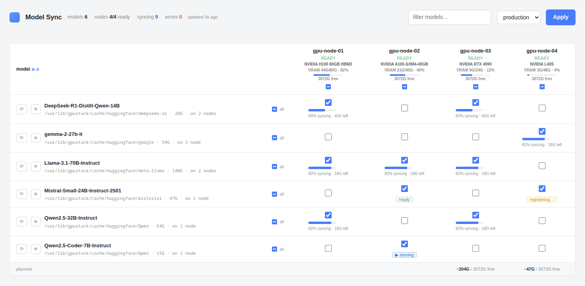
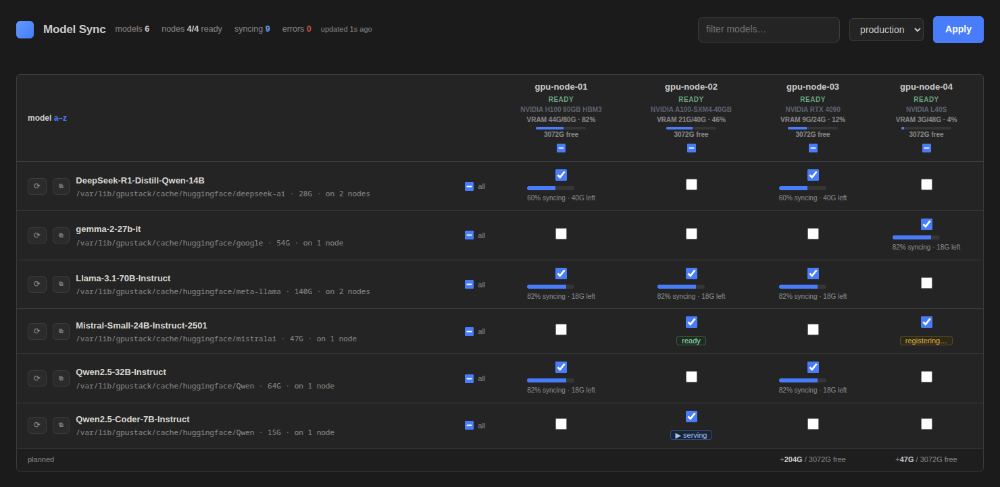

# gpustack-modelsync

Keep GPUStack model folders in sync across cluster nodes. Pick **which models**
go to **which nodes** (or all), in a small web UI. Replication is done by
[Syncthing](https://syncthing.net): full local copies, P2P, no central host, no
single point of failure.

This is an orchestrator. It reads your GPUStack workers, then drives the
Syncthing instance on each worker over its REST API so that each model folder is
shared with exactly the nodes you chose.

```
GPUStack server ──/v2/workers──▶ orchestrator ──Syncthing REST──▶ syncthing on each worker
                                      │                              (P2P replicates cache-dir subfolders)
                                  matrix UI: model × node + sync %
```

## Screenshots

The whole tool is one page: a **model × node matrix**. Tick where each model
should live, hit **Apply**, watch the bars fill. Node headers show GPU, VRAM and
free disk; cells show live sync %, and badges for **serving** / **ready** /
**registering** / GPUStack **downloading**.



Automatic dark mode (follows the GPUStack dashboard palette):



### Try it without a cluster

A built-in demo boots the orchestrator against a fake GPUStack + fake Syncthing
serving sample data (loopback only, nothing real is touched):

```bash
uv run python scripts/demo.py        # then open http://127.0.0.1:18585
```

## What it does

- **Static, internet-free discovery.** Peers connect only via the GPUStack node
  IPs (`tcp://<ip>:22000`). Global discovery, relays, NAT traversal, usage
  reporting and crash reporting are all forced **off** on every node
  (`enforce_local_only`). Nothing talks to the internet.
- **No manual accept.** The orchestrator writes *both* sides of every share, so
  paired nodes trust each other automatically. Operate within one GPUStack
  cluster (the UI is per-cluster); pick the cluster, tick the matrix, apply.
- **Safe unshare.** Unticking a node removes the share but **leaves its local
  files on disk** (it just stops syncing). Freeing disk is a separate action.
- **Paths from GPUStack, not config.** Model directories come straight from the
  API (`ModelFile.local_dir`, absolute) — no cache-dir setting, no path
  guessing. The only static path is the volume mount (below), which must equal
  GPUStack's own cache mount so those absolute paths are valid in the sidecar.
- **Live progress**, per node per model, in the UI (Syncthing completion %).
- **Capacity + state aware.** Won't target a node that's NOT_READY, unreachable
  or in maintenance, one whose free disk (`MountPoint.free`) is smaller than
  the model (`ModelFile.size`), or one GPUStack is **still downloading the model
  to** (two writers into one directory). Skips are reported, never silent. A
  node that already holds the model is never rejected.
- **Full automation (the point).** A background loop (`RECONCILE_INTERVAL`) keeps
  three things in agreement with your plan: Syncthing shares, GPUStack
  registration, and orphan cleanup. Tick a node → it syncs, and once complete the
  model is **registered in GPUStack on that node by cloning the source spec**
  (huggingface repo etc.) so GPUStack shows it as the *same* model and can
  schedule it there. Untick → unshare + **deregister** the copy we added (only
  ever the records *we* created, tracked in `registry.json`; your originals are
  never touched). Orphaned folders are garbage-collected.
- **Rich status from both APIs.** Per node/model the UI shows Syncthing folder
  **state** (idle/syncing/scanning/**error**), **bytes remaining**, and error
  count — a stuck/conflicted folder shows up as `error`, not a silent stall. Node
  headers show GPU model, **VRAM used/total**, utilization, and worker version
  (from `WorkerStatus`). A model running on a node is flagged **serving** (from
  model instances).
- **Live + auto-refresh.** GPUStack SSE watch (`/v2/workers?watch=true`) proxied
  to `/events`; the model list and node info also refresh on a timer.
- **Conflict-free distribution + recovery.** Shares are master→replica
  (source `sendonly`, replicas `receiveonly` + auto-revert), which avoids the
  version-vector conflict a symmetric share hits when a replica already holds
  files. The `⟳` reset action (or `POST /reset {path}`) recovers a stuck folder:
  override on the source, and for a replica whose index is poisoned, pause → drop
  its index DB → unpause so it rebuilds from the source. Healthy replicas just
  revert (no-op).
- **GPUStack-matched UI.** Styled with the design tokens from the gpustack-ui
  source (primary `#007BFF`, success `#54cc98`, antd table/tags), including an
  OS-auto **dark mode** using GPUStack's realDark palette. Per-node
  GPU/VRAM/util headers with live transfer rates, summary bar, filter (`/` to
  focus, Esc to clear), bulk row/column selection, capacity preview footer,
  per-model reset + copy-path, per-copy purge.
- **Event-driven.** Watches each node's Syncthing events (folder completion /
  errors) and GPUStack's SSE streams (worker + model-file create/delete): a
  finished sync registers within seconds; the interval is only a fallback.
- **Never ships partials.** Nodes GPUStack is still downloading to are never
  used as a sync source, and `.stignore` patterns exclude temp/partial files
  from replication.
- **Scheduler pinning (opt-in).** `POST /pin {path, model_id}` labels every node
  holding the folder and points the Model's `worker_selector` at that label, so
  GPUStack schedules instances onto nodes that already have the weights;
  reconcile keeps labels current as copies appear/disappear. `/unpin` restores
  the original selector.
- **Disk reclaim.** `POST /purge {path, worker_id, delete_files}` (or the 🗑
  button) removes one node's copy: unshare + deregister + optionally have
  GPUStack delete the files. Refused while an instance is running from it.
- **Observability.** `GET /metrics` (Prometheus): rows/complete/clean/errors,
  plan size, unreachable nodes, registered/deregistered/stuck-resolved counters.
  `GET /net`: per-node connected peers + real transfer rates.

## What it does NOT do (be clear)

GPUStack's native "Downloading" progress bar is owned by GPUStack's own
downloader; the API has **no writable progress/state field**. So a Syncthing
transfer cannot drive that native *bar* without forking the GPUStack frontend.
The model still appears **present** in GPUStack once synced (we register it), and
the live mid-transfer percentage shows in *this* UI.

## Deploy

Container-only, like GPUStack workers themselves — no bare-metal path.
Two roles: the **orchestrator** runs once; a **Syncthing** runs on every worker
node, mounting the **same model-cache volume the GPUStack worker uses** at the
same path. The orchestrator forces every node LAN-only at runtime, so the
containers never phone home.

### Docker Compose (single host / per worker host)

```bash
docker build -t gpustack-modelsync:0.1.0 .
# .env: GPUSTACK_URL, GPUSTACK_TOKEN, SYNCTHING_API_KEY, AUTH_TOKEN (required)
# point volumes.gpustack-cache.name at GPUStack's real cache volume (docker volume ls)
docker compose up -d
```

`docker-compose.yml` runs the orchestrator + one Syncthing sidecar. The sidecar
mounts `gpustack-cache:/var/lib/gpustack/cache` (external volume = GPUStack's)
on host networking, and persists its device identity in `syncthing-config`. On a
real cluster, the Syncthing service runs **per worker host**; for that, use k8s.

### Kubernetes (multi-node)

```bash
kubectl -n gpustack create secret generic modelsync --from-literal=auth-token=<api-token> \
  --from-literal=syncthing-api-key=<shared> --from-literal=gpustack-token=<token>
kubectl apply -f k8s.yaml
```

`k8s.yaml` = a **DaemonSet** (one Syncthing per worker node, hostNetwork,
mounting that node's `/var/lib/gpustack/cache`) + the orchestrator Deployment +
Service. Adjust `nodeSelector` and the cache mount (hostPath vs the worker's PVC)
to your GPUStack install.

> The Syncthing container runs as root (`PUID/PGID=0`) so it can read/write the
> cache files whatever their owner. Match GPUStack's uid instead to harden.

Once up, open the orchestrator UI (`:8585`), pick a cluster, tick model × node,
**Apply plan**, watch the bars.

Ports: Syncthing data `22000/tcp` open **between worker nodes**; GUI `8384/tcp`
reachable **from the orchestrator** only. The shared API key guards the GUI —
keep it on the cluster network. (Both handled by `hostNetwork` in `k8s.yaml`.)

## Config (env, prefix `MODELSYNC_`)

| var | default | meaning |
|---|---|---|
| `GPUSTACK_URL` | `http://localhost:80` | GPUStack server (note: 2.x defaults to port 8080) |
| `GPUSTACK_TOKEN` | — | GPUStack Bearer API key |
| `GPUSTACK_API_PREFIX` | `/v2` | `/v2` for GPUStack 2.x, `/v1` for older |
| `AUTH_TOKEN` | — | token required on **all** API routes (`X-Auth-Token`/`Bearer`; `/events` via `?token=`). **Set this**; empty refuses to start unless `LISTEN_HOST` is loopback |
| `AUTH_EXEMPT_CIDRS` | `127.0.0.0/8,::1/128` | requests whose **socket peer** IP is in these CIDRs skip the token (trusted local). Never matched on forwarded headers. Under Docker, host-local traffic arrives from the bridge gateway — add e.g. `172.17.0.1/32` and/or the host's own IP `/32` for tokenless same-machine access. Don't add your whole LAN unless every device may control the cluster |
| `LISTEN_HOST` | `0.0.0.0` | bind interface; must be loopback if `AUTH_TOKEN` is empty |
| `ALLOWED_WORKER_CIDRS` | private ranges (no loopback) | only contact workers whose IP is in these CIDRs (SSRF guard) |
| `CACHE_ROOTS` | `/var/lib/gpustack` | only sync model dirs under these roots (rejects arbitrary paths from a compromised GPUStack) |
| `SYNCTHING_API_KEY` | — | shared key, same on every worker |
| `SYNCTHING_API_KEYS` | — | optional per-node keys `ip=key,ip=key`; listed nodes use theirs, others the shared key. Rotate away from one shared key so a compromised node can't reach every peer |
| `SSL_CERTFILE` / `SSL_KEYFILE` | — | serve the orchestrator over TLS (set both). Required for the userscript when GPUStack is https (mixed content) |
| `SYNCTHING_GUI_PORT` | `8384` | per-worker Syncthing GUI |
| `SYNCTHING_DATA_PORT` | `22000` | per-worker Syncthing data |
| `REGISTER_IN_GPUSTACK` | `true` | after sync, register the model on the new node in GPUStack (clone source spec); deregister on removal |
| `RECONCILE_INTERVAL` | `15` | fallback seconds between reconcile passes; Syncthing/GPUStack **events wake the loop immediately**, so completed syncs register within seconds |
| `SYNC_MAX_SEND_KBPS` / `SYNC_MAX_RECV_KBPS` | `0` (off) | cap Syncthing transfer rates on every node so a model sync can't saturate the LAN during inference |
| `STATE_DIR` | `.` | dir for plan/registry/members/pins state files (mount a volume here) |
| `LISTEN_PORT` | `8585` | orchestrator UI |

## API

All routes need the token (`X-Auth-Token` or `Bearer`) unless the peer is in
`AUTH_EXEMPT_CIDRS`. Everything the UI does goes through these:

| endpoint | what |
|---|---|
| `GET /nodes` | workers incl. GPU/VRAM/disk/labels |
| `GET /clusters` | cluster id → display name |
| `GET /models` | model folders: plan/have/pending/serving per node |
| `POST /plan {plan:{path:[ids]}}` | apply the full desired matrix (validated; skips report as warnings) |
| `GET /status` | per (model, node): completion, state, bytes, integrity `clean` flag |
| `GET /net` | per node: connected peers + real in/out transfer rates |
| `GET /metrics` | Prometheus exposition (rows, clean, errors, counters) |
| `POST /reset {path}` | operator recovery: override clean source + index-reset stuck replicas |
| `POST /purge {path, worker_id, delete_files}` | remove one node's copy (record + optionally bytes) |
| `POST /pin {path, model_id}` / `POST /unpin {model_id}` | scheduler pinning via worker labels + `worker_selector` |
| `GET /suggest` | copies serving on nodes not yet in the plan |
| `GET /events?token=` | SSE nudge stream for UI auto-refresh |

## Compatibility

Schemas + paths verified against a live **GPUStack v2.2.0** OpenAPI spec: `/v2`
prefix, `perPage` pagination, `watch` SSE on `/v2/workers`, `WorkerUpdate`
accepts `labels`, `Model.worker_selector` is writable, `MountPoint.free`,
`ModelFile.{local_dir,size}`, `ModelInstance.{model_id,worker_id,resolved_path}`,
`SourceEnum.local_path`. Older GPUStack: set `GPUSTACK_API_PREFIX=/v1`.

## In-dashboard UI (Tampermonkey, no fork)

A userscript embeds the matrix into the GPUStack dashboard itself (per operator,
no GPUStack fork). Install from the orchestrator's **LAN-reachable** URL (not
`localhost` — the browser viewing GPUStack must reach it):

```
Tampermonkey → Create/Install from URL → http://<orchestrator-host>:8585/userscript.js
```

It adds a floating **↻ Model Sync** button on the GPUStack pages (`@match` is set
to your `GPUSTACK_URL` origin). Click → a drawer with the model×node matrix. It
calls the orchestrator via `GM_xmlhttpRequest` (bypasses CORS), prompting once
for the `AUTH_TOKEN` (stored with `GM_setValue`). `@updateURL` points back at the
orchestrator, so it auto-updates.

Caveats: per-browser install; `@connect`/API come from the install URL, so use
the right host; if GPUStack is served over **https**, the orchestrator must be
too (browsers block mixed-content requests). Renders inline (no iframe), so our
`X-Frame-Options: DENY` doesn't block it.

## Security

The orchestrator mutates GPUStack and reconfigures Syncthing on every node, so:
- **Set `AUTH_TOKEN`.** **All** API routes (reads + mutations; `/events` via a
  `?token=` query) then require it (`X-Auth-Token` or `Bearer`), compared in
  constant time; the UI prompts once and stores it. Only `/` and `/app.js` are
  open. Empty token = open API (logged warning) — only for a trusted loopback.
- **Worker IPs are CIDR-allowlisted** (`ALLOWED_WORKER_CIDRS`) before the shared
  Syncthing key is ever sent to them (SSRF / key-exfil guard).
- **UI is XSS-hardened**: all GPUStack-derived strings are escaped, no inline
  event handlers, and a CSP blocks injected/foreign scripts.
- Prefer **`https://` for `GPUSTACK_URL`** so the token isn't sent in cleartext
  (a startup warning fires otherwise), and set `SSL_CERTFILE`/`SSL_KEYFILE` to
  serve the orchestrator itself over TLS.
- Keep the Syncthing GUI on the private cluster network. Use **per-node keys**
  (`SYNCTHING_API_KEYS=ip=key,...`) instead of one shared key so a compromised
  node can't reach every peer (a warning fires when the shared key is in use).
  Running Syncthing as the cache UID (not root) is the remaining hardening step.
- Destructive endpoints are path-gated: purge/pin/sync targets must sit under
  `CACHE_ROOTS`, so a compromised GPUStack record can't point them at `/etc`.

## Limitations / next steps

- **Replication, so copy-first.** A model is usable on a node only after its
  copy completes (Syncthing, like rsync). Pre-stage before scheduling inference
  there. For *instant* access to a not-yet-local model you'd add a read-through
  layer (a small HTTP byte-range fetch from a peer that already has the file,
  serving local once Syncthing finishes). Deliberately not built — add only if
  cold-start latency proves to matter.
- **Plan stored in `plan.json`** next to the orchestrator. Fine for one
  instance; move to GPUStack's DB if you want it co-located.
- **One orchestrator instance.** State files + the reconcile lock assume a
  single replica (k8s Deployment `replicas: 1`); no leader election.
- **Unshare needs the node reachable.** Reconcile only touches nodes still
  referenced by the plan/registry, so removing a model from a node that is
  **unreachable at that moment** deregisters its GPUStack record but can't clean
  the Syncthing folder config on the node itself; it's left an inert orphan (its
  peers have already dropped it, so nothing syncs, and the files stay on disk).
  Re-tick then untick while the node is reachable, or clear it with `⟳` reset,
  to remove the stale folder.

## Verification

Three machine-checked layers, each covering what the others can't:

```bash
uv run pytest -q                              # unit + integration tests
uv run pyright                                # strict type check, 0 errors
uv run ruff check modelsync                   # lint, 0 errors
```

- **Type safety (proved by pyright).** `typeCheckingMode = "strict"`, zero errors.
  This proves the absence of a whole error class in the typed core: no
  None-access, bad-attribute, operator, or argument type mismatches.
- **Parser totality (proved by property-based fuzzing).** `tests/test_fuzz.py`
  runs every parser on the untrusted boundary (GPUStack/Syncthing JSON, corrupt
  state files) against `hypothesis`-generated arbitrary input. Contract: a parser
  never raises, only degrades to a safe default. This covers the one place types
  can't — the dynamically-typed JSON boundary (`Any`), where the strict
  `reportUnknown*` rules are therefore disabled (see `[tool.pyright]`).
- **Behavior (tested + live-validated).** The pytest suite plus end-to-end runs on a real
  multi-node cluster (add → sync → register → remove → deregister, plus failure
  and recovery paths).

Together: types prove the typed core, fuzz proves the untyped edge. What stays
unprovable (by Rice's theorem, for any non-trivial program) is full functional
correctness of the distributed logic — covered by tests and live validation, not
a proof.
